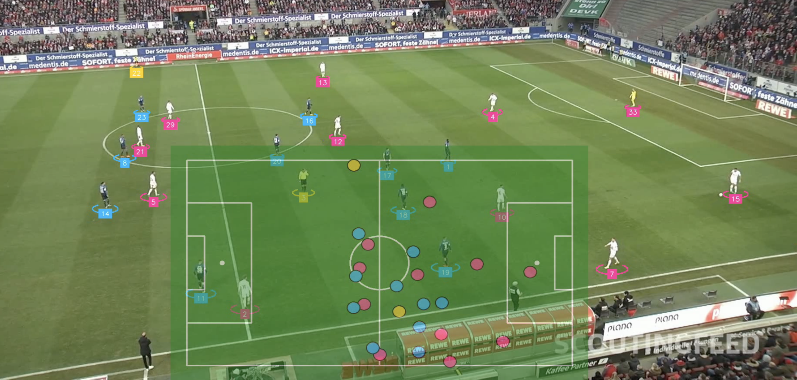
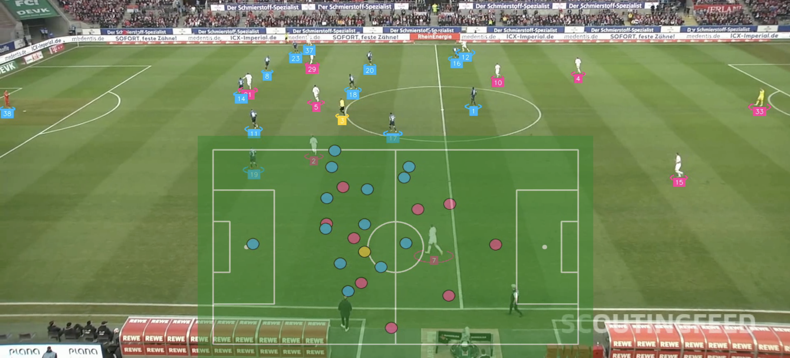
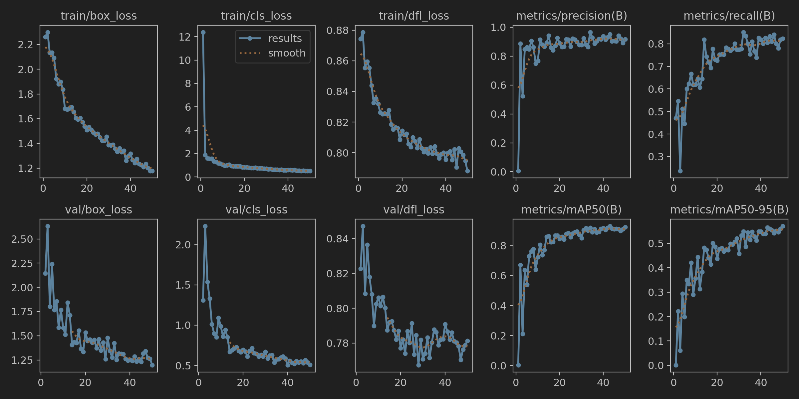
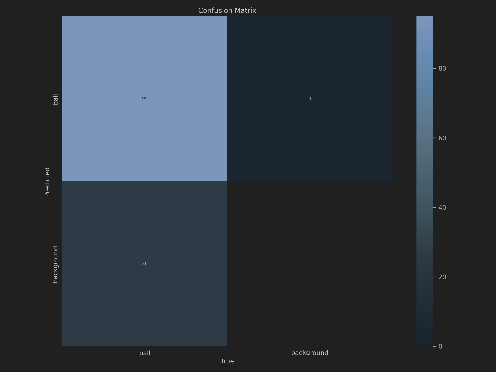
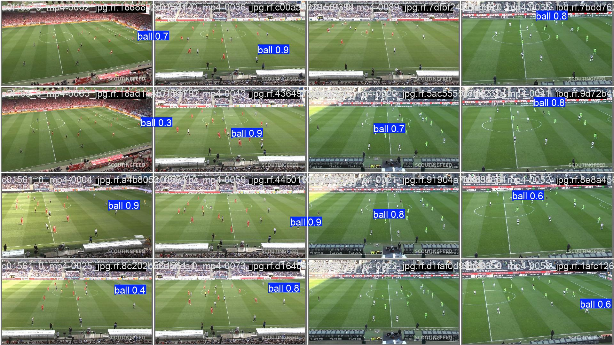
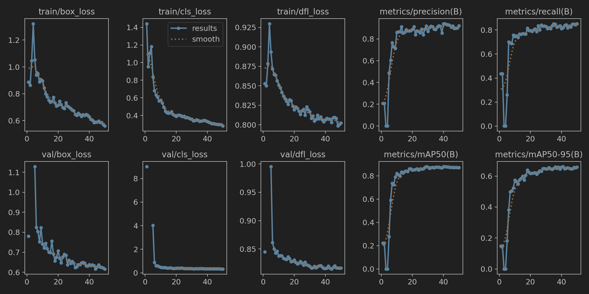
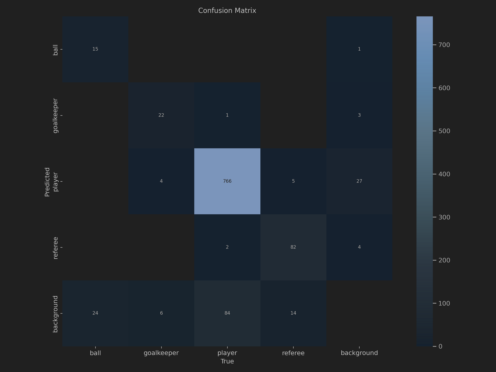
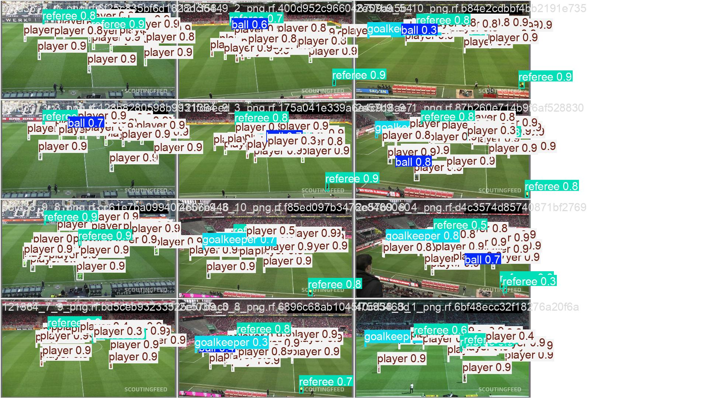
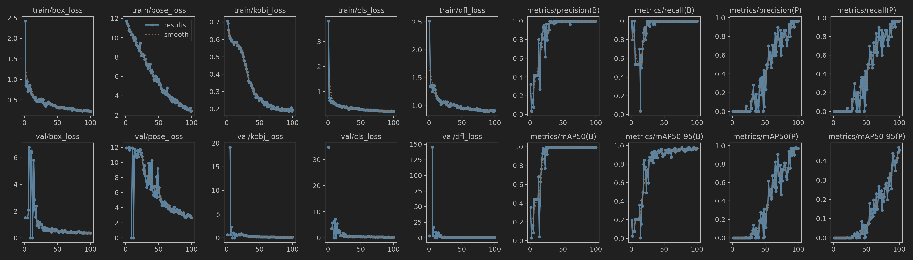
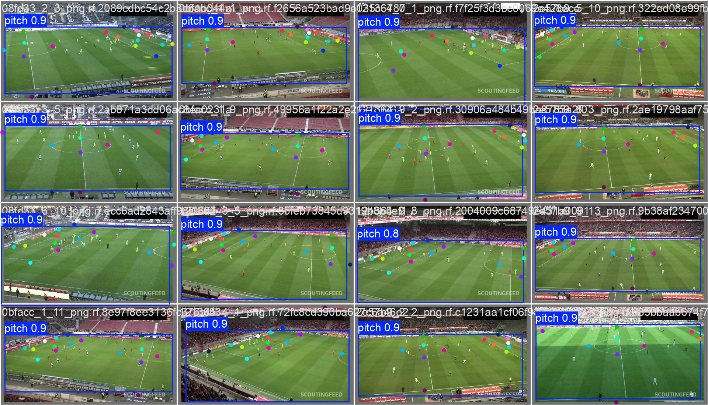

---

#  Soccer AI 🧠
## Demo
<p align="center">
   
  
  
  
</p>

## 📝 Overview
Research and development of AI models for soccer analytics and insights. This project aims to provide tools for detecting players, goalkeepers, referees, and the ball in soccer videos. It also includes features for tracking player movements, classifying players into teams, and visualizing player positions on the soccer field.
### Train ball detectors
<p align="center">
  <div style="display: inline-block; margin: 10px;">
    <p><strong>Train Results</strong></p>
    
  </div>
  <div style="display: inline-block; margin: 10px;">
    <p><strong>Confusion Matrix</strong></p>
    
  </div>
  <div style="display: inline-block; margin: 10px;">
    <p><strong>Result for Validation</strong></p>
    
  </div>
</p>

### Train player detectors
* train results

* Confession matrix

* Result for Validation


### train pitch keypoint detectors
* train results

* Result for Validation
* 

## 💻 Installation Guide

We don't have a Python package yet, but you can install from the source in a [**Python>=3.8**](https://www.python.org/) environment. Follow the steps below:

```bash
pip install https://github.com/A7medM0sta/soccer.git
pip install -r requirements.txt
./setup.sh
```

## 📊 Datasets

Original data comes from the [DFL - Bundesliga Data Shootout](https://www.kaggle.com/competitions/dfl-bundesliga-data-shootout) Kaggle competition. This data has been processed to create new datasets, which can be downloaded from [Roboflow Universe](https://universe.roboflow.com/).

| ⚽ Use Case | 📂 Dataset | 🧑‍🏫 Train Model |
|:-------------------------------:|:------------------------------------------------------------------------------------------------------------------------------------------------------------------:|:----------------------------------------------------------------------------------------------------------------------------------------------------------------:|
| 👨‍🏫 Soccer Player Detection | [](https://universe.roboflow.com/roboflow-jvuqo/football-players-detection-3zvbc) | [](https://colab.research.google.com/github/roboflow/sports/blob/main/examples/soccer/notebooks/train_player_detector.ipynb) |
| ⚽ Soccer Ball Detection | [](https://universe.roboflow.com/roboflow-jvuqo/football-ball-detection-rejhg) | [](https://colab.research.google.com/github/roboflow/sports/blob/main/examples/soccer/notebooks/train_ball_detector.ipynb) |
| 🏟️ Soccer Pitch Keypoint Detection | [](https://universe.roboflow.com/roboflow-jvuqo/football-field-detection-f07vi) | [](https://colab.research.google.com/github/roboflow/sports/blob/main/examples/soccer/notebooks/train_pitch_keypoint_detector.ipynb) |

## 🧠 Models

- [YOLOv8](https://docs.ultralytics.com/models/yolov8/) (Player Detection) - Detects players, goalkeepers, referees, and the ball in the video.
- [YOLOv8](https://docs.ultralytics.com/models/yolov8/) (Pitch Detection) - Identifies the soccer field boundaries and key points.
- [SigLIP](https://huggingface.co/docs/transformers/en/model_doc/siglip) - Extracts features from image crops of players.
- [UMAP](https://umap-learn.readthedocs.io/en/latest/) - Reduces the dimensionality of the extracted features for easier clustering.
- [KMeans](https://scikit-learn.org/stable/modules/generated/sklearn.cluster.KMeans.html) - Clusters the reduced-dimension features to classify players into two teams.

## ⚙️ Modes

### 🏟️ Pitch Detection
Detects the soccer field boundaries and key points in the video. Useful for identifying and visualizing the layout of the soccer pitch.

```bash
python main.py --source_video_path data/2e57b9_0.mp4 --target_video_path data/2e57b9_0-pitch-detection.mp4 --device mps --mode PITCH_DETECTION
```


### 🧑‍🤝‍🧑 Player Detection
Detects players, goalkeepers, referees, and the ball in the video. Essential for identifying and tracking the presence of players and other entities on the field.

```bash
python main.py --source_video_path data/2e57b9_0.mp4 --target_video_path data/2e57b9_0-player-detection.mp4 --device mps --mode PLAYER_DETECTION
```


### ⚽ Ball Detection
Detects the ball in the video frames and tracks its position. Useful for following ball movements throughout the match.

```bash
python main.py --source_video_path data/2e57b9_0.mp4 --target_video_path data/2e57b9_0-ball-detection.mp4 --device mps --mode BALL_DETECTION
```


### 🏃‍♂️ Player Tracking
Tracks players across video frames, maintaining consistent identification. Useful for following player movements and positions throughout the match.

```bash
python main.py --source_video_path data/2e57b9_0.mp4 --target_video_path data/2e57b9_0-player-tracking.mp4 --device mps --mode PLAYER_TRACKING
```


### 🏳️‍ Team Classification
Classifies detected players into their respective teams based on their visual features. Helps differentiate between players of different teams for analysis and visualization.

```bash
python main.py --source_video_path data/2e57b9_0.mp4 --target_video_path data/2e57b9_0-team-classification.mp4 --device mps --mode TEAM_CLASSIFICATION
```


### 🎯 Radar Mode
Combines pitch detection, player detection, tracking, and team classification to generate a radar-like visualization of player positions on the soccer field. Provides a comprehensive overview of player movements and team formations.

```bash
python main.py --source_video_path data/2e57b9_0.mp4 --target_video_path data/2e57b9_0-radar.mp4 --device mps --mode RADAR
```


---


## References
* https://github.com/roboflow/notebooks/blob/main/notebooks/train-yolov8-object-detection-on-custom-dataset.ipynb) 
* https://github.com/roboflow/notebooks
* 
